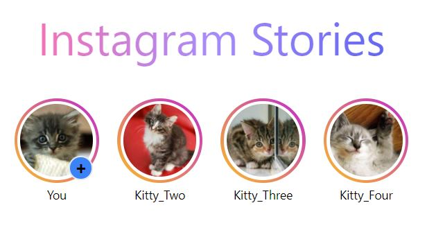

# Aplicacion sencilla con ReactJS + TailwindCSS y Emotion



Para instalar aplicacion ejecutar:

```
npm install
```

Para iniciar aplicacion ejecutar

```
npm start
```

------

Referencia de proyecto:

[Tailwind Labs](https://www.youtube.com/channel/UCOe-8z68tgw9ioqVvYM4ddQ)

